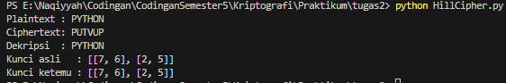

# Hill Cipher

Program sederhana untuk enkripsi, dekripsi, dan mencari kunci pada **Hill Cipher**.  

---

## Fitur
1. **Enkripsi** plaintext menjadi ciphertext dengan rumus:
   \[
   C = K \times P \pmod{26}
   \]

2. **Dekripsi** ciphertext menjadi plaintext dengan rumus:
   \[
   P = K^{-1} \times C \pmod{26}
   \]

3. **Cari kunci** dari pasangan plaintext–ciphertext dengan:
   \[
   K = C \times P^{-1} \pmod{26}
   \]

---

## Alur Program
1. **Konversi teks**  
   - Setiap huruf dikonversi ke angka 0–25 (`A=0, B=1, ..., Z=25`).

2. **Bentuk blok matriks**  
   - Jika kunci ordo 2x2 → plaintext dipecah jadi blok 2 huruf.  
   - Jika panjang plaintext tidak habis dibagi, akan ditambah huruf `X`.

3. **Enkripsi**  
   - Hitung perkalian matriks `K × P` (mod 26).  
   - Hasil konversi balik ke huruf jadi ciphertext.

4. **Dekripsi**  
   - Cari invers dari matriks kunci `K`.  
   - Hitung `K⁻¹ × C` (mod 26).  
   - Konversi balik ke huruf → plaintext asli.

5. **Cari kunci**  
   - Dari pasangan plaintext–ciphertext dengan panjang minimal \(n^2\).  
   - Bentuk matriks `P` dan `C`.  
   - Hitung `K = C × P⁻¹ (mod 26)`.  
   - Validasi apakah `K` bisa diinvers mod 26.

---

## Hasil Running
